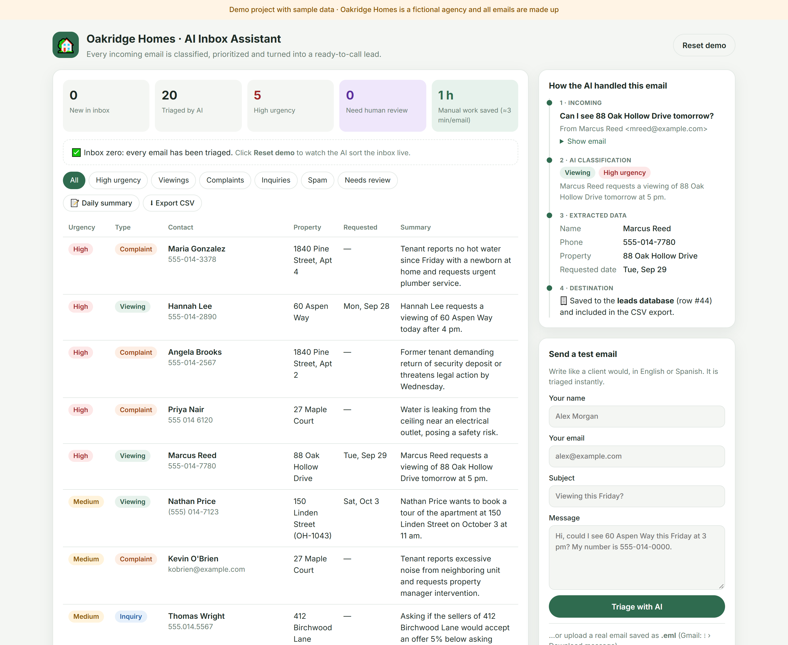
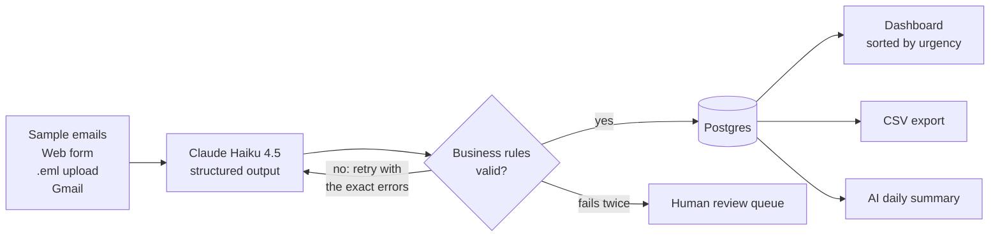
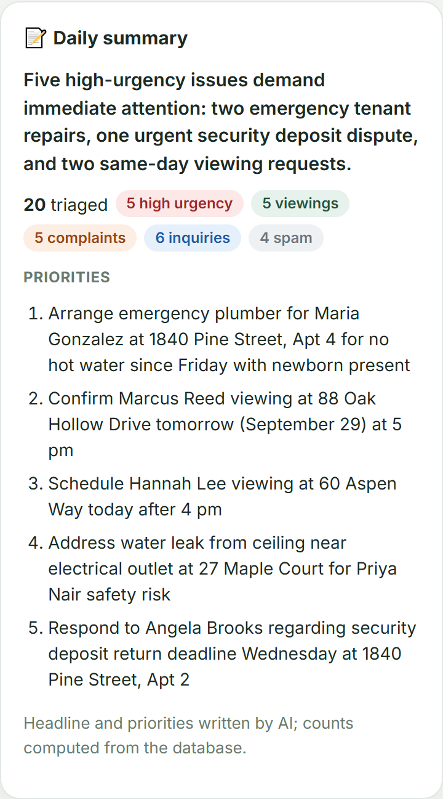

# AI Email Automation

**AI triage for a real estate agency's inbox: every email is classified, prioritized and turned into a ready-to-call lead, and anything the AI isn't sure about goes to a human.**

[](https://github.com/felixmartinezastorquiza-dot/ai-email-automation/actions/workflows/ci.yml)

**Live demo:** [ai-email-automation-abok.onrender.com](https://ai-email-automation-abok.onrender.com) · [API docs](https://ai-email-automation-abok.onrender.com/docs) · Evaluation: **20/20 emails classified correctly**

> Hosted on a free tier: the first visit after a period of inactivity can take up to a minute while the server wakes up.



---

## The problem

A real estate agency receives dozens of emails a day: questions about listings, viewing requests, tenant complaints and spam. Someone has to read each one, decide what it is, copy names, phone numbers and dates into a spreadsheet, and hope an urgent complaint doesn't get buried under marketing emails.

## The solution

A pipeline for **Oakridge Homes**, a fictional agency:

1. **Incoming:** sample emails, a web form, `.eml` uploads, or Gmail through an [optional module](docs/gmail-integration.md).
2. **AI classification:** Claude returns a structured analysis: category (inquiry, viewing request, complaint, spam), urgency, contact name, phone, property and requested date. Relative dates like "tomorrow" are resolved from the date the email arrived.
3. **Validation:** business rules check the answer. A failed check is sent back to the model with the exact error; if it fails again, the email is flagged for **human review** instead of guessing.
4. **Destination:** results are stored in Postgres, sorted so urgent items come first, and can be exported to CSV.

On top of that, a **daily summary** gives the office manager the day's priorities, and the dashboard shows the **manual time saved**.





## Tech stack

| Layer | Choice |
|---|---|
| API | Python 3.12, FastAPI, Pydantic |
| LLM | Anthropic Claude Haiku 4.5 with structured output (swappable to OpenAI with one env var) |
| Storage | PostgreSQL (Neon free tier) with a connection pool |
| Frontend | HTMX + Jinja2 templates: server-rendered, almost no JavaScript |
| Quality | pytest (39 tests, a real Postgres in CI), ruff, GitHub Actions, end-to-end `eval.py` |
| Deployment | Docker, Render (Blueprint in `render.yaml`) |

## Key decisions

- **Two layers of validation.** Structured output guarantees the *shape* (a valid category, a real date). Business rules catch what a schema can't: a viewing date before the email arrived, a phone number with 3 digits, spam marked urgent. Only those trigger the retry, and the model gets the exact error to fix.
- **"Needs human review" instead of a guess.** After two failed attempts, the email is stored without extracted data and routed to people. Wrong data in a CRM is worse than no data.
- **Counts are computed in code, not by the LLM.** The first version of the daily summary let the model count emails, and it reported 4 urgent items when there were 6. Now the database computes the numbers and the model only writes the headline and priorities.
- **A work queue with `FOR UPDATE SKIP LOCKED`.** Emails are claimed one at a time, so two visitors (or two workers) never process the same email. The dashboard uses HTMX to process the inbox one email at a time, so the table fills in live.
- **Inputs from strangers are treated as data.** Email text is wrapped and the prompt tells the model to ignore instructions inside it (prompt injection). The CSV export neutralizes cells starting with `=`, `+`, `-` or `@` so a malicious subject can't run as a spreadsheet formula.

## Evaluation

`eval.py` runs the 20 labeled sample emails through the real model and checks category, urgency and every extracted field:

```
Category correct:    20/20 (target >= 18)
Urgency correct:     20/20
name correct:        20/20
phone correct:       20/20
property correct:    20/20
requested_date correct:20/20
Needed a retry:      0   Flagged for review: 0
Result: PASSED
```

The urgency rules are written in the prompt, so "urgent" is a defined policy rather than the model's opinion. When a borderline email ("I'm starting to look at other agencies") was rated differently across runs, the fix was to make the policy explicit, and then confirm the result was stable over repeated runs.

## Run locally

You need free accounts on [Anthropic](https://console.anthropic.com) and [Neon](https://neon.tech) (any Postgres works).

```bash
python -m venv .venv
.venv\Scripts\activate               # Windows
# source .venv/bin/activate          # macOS / Linux
pip install -e ".[dev]"
cp .env.example .env                 # then fill in your keys

uvicorn app.main:app                 # the sample inbox is loaded on first start
```

Open http://127.0.0.1:8000 and click **Process inbox with AI**. API docs: http://127.0.0.1:8000/docs.

```bash
pytest                               # set TEST_DATABASE_URL to a separate, empty database
python eval.py                       # end-to-end evaluation (uses the API, ~US$0.03)
```

### With Docker

```bash
docker build -t ai-email-automation .
docker run --env-file .env -p 8000:8000 ai-email-automation
```

### Deploy to Render

Push the repository to GitHub, then in Render choose **New > Blueprint** and select it. Enter `ANTHROPIC_API_KEY` and `DATABASE_URL` when prompted.

## API

| Method | Path | Description |
|---|---|---|
| `POST` | `/api/triage` | Triage one email (JSON) without storing it. Ready for Zapier, Make or n8n |
| `GET` | `/export.csv` | Download triaged emails |
| `GET` | `/health` | Liveness check |

The dashboard routes (`/inbox`, `/emails`, `/summary`, `/reset`) return HTML fragments for HTMX.

## What I'd add for production

- **Real mailbox connection:** Gmail push notifications (Pub/Sub) or Microsoft Graph for Outlook, with the message ID stored so nothing is processed twice. See [docs/gmail-integration.md](docs/gmail-integration.md).
- **Act on the result:** create leads in the agency's CRM, send an auto-reply that confirms viewing requests, and page the on-call manager for high-urgency complaints.
- **Authentication and per-agency data,** instead of one shared demo inbox.
- **Background workers:** move triage to a queue so large inboxes don't depend on the browser staying open.
- **Monitoring:** cost and latency per email, review-queue size, and alerts when the AI service fails.
- **A larger evaluation set** built from real (anonymized) emails, run in CI on every prompt change.

---

*Demo project built for portfolio purposes. Oakridge Homes is a fictional company and all emails contain sample data.*

Built by **Felix Martinez** · Python & AI Integration Developer
